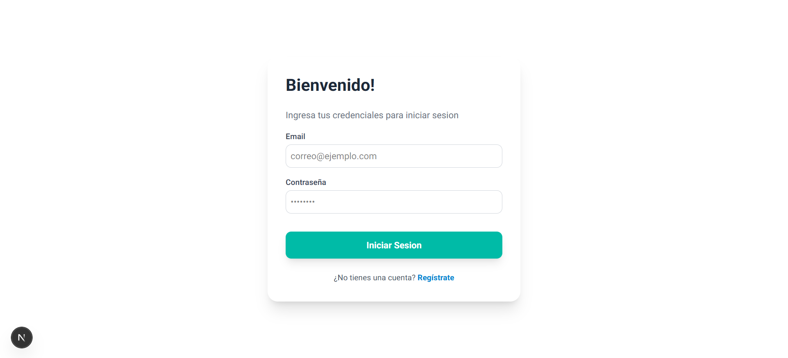
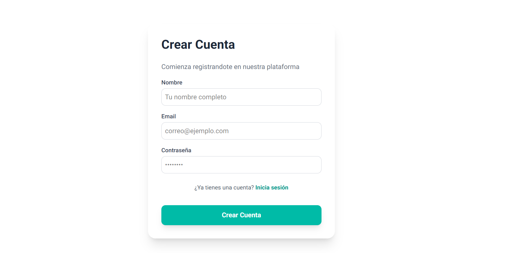
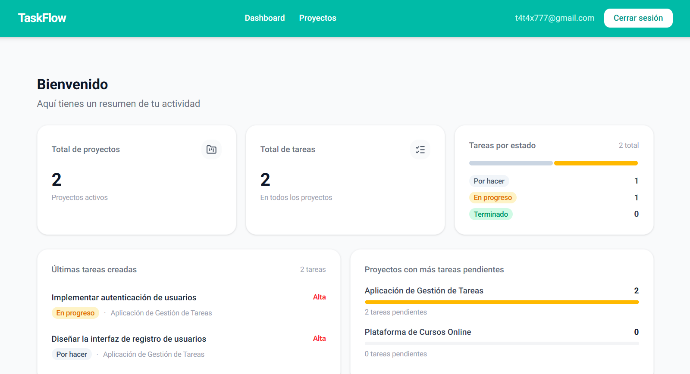
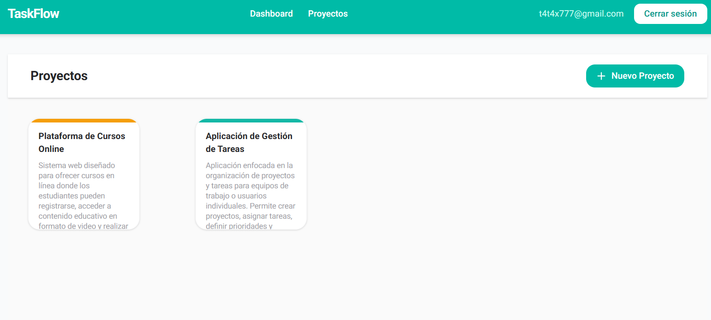
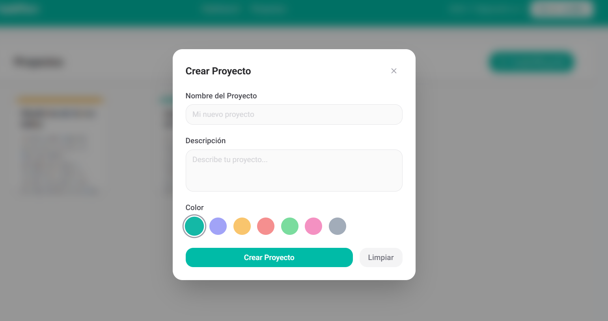
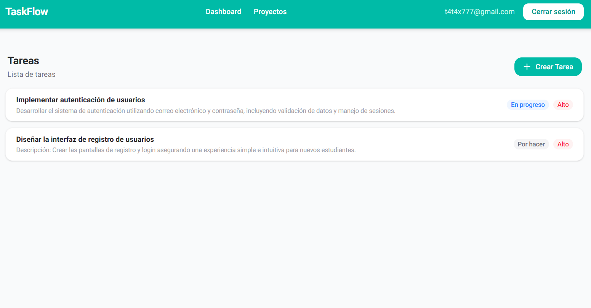
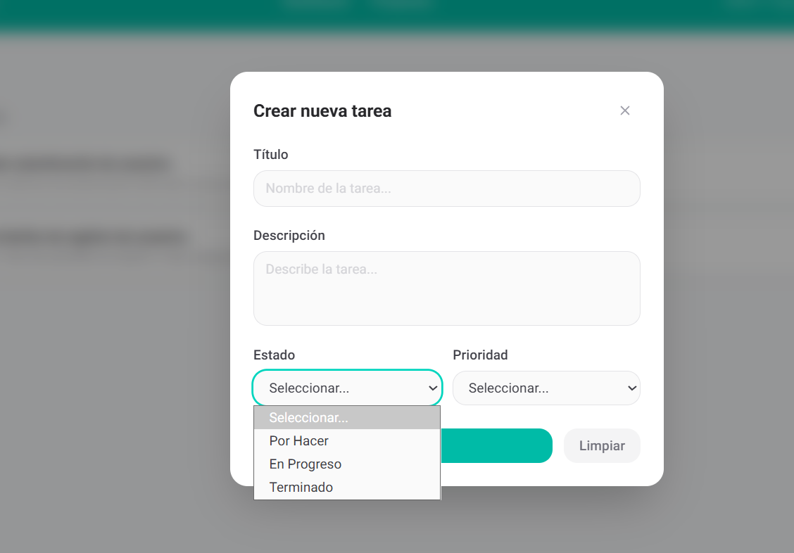
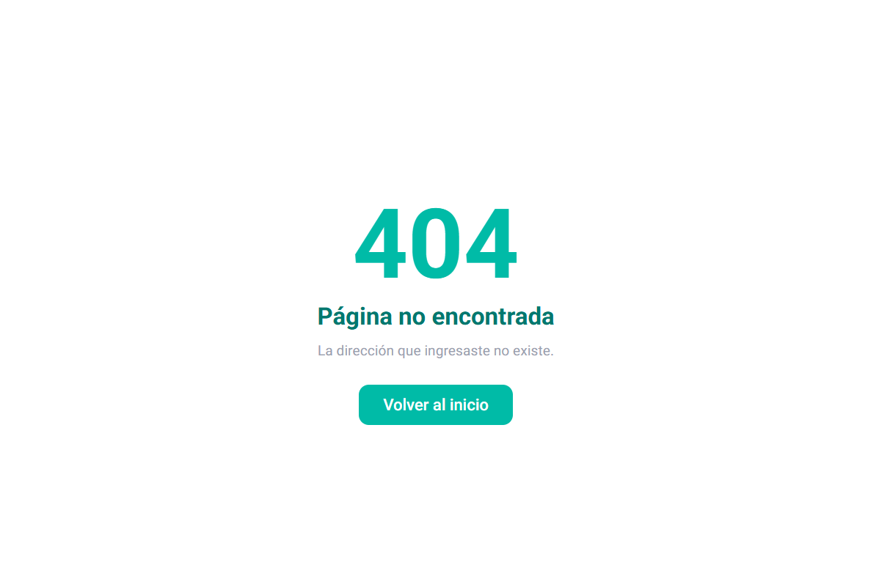

# Task Manager API
 
TaskFlow es una aplicacion para la gestion de proyectos y tareas personales.
---
 
## Tecnologías
 
- **Next.js** (App Router / Route Handlers)
- **Node.js** v22.21.1
- **Prisma** v7.5.0
- **PostgreSQL**
- **Docker / docker-compose**  v29.2.1
- **Supabase**
---
```bash
# 1. Clonar el repositorio
git clone https://github.com/Andross3/taskflow-prueba-tecnica.git
 
# 2. Instalar dependencias
npm install
 
# 3. Configurar variables de entorno
cp .env.example .env
# Editar .env.local con tus valores de Supabase
 
# 4. Ejecutar migraciones
npx prisma migrate deploy
 
# 6. Iniciar el servidor
npm run dev
```
 
---
 
## Esquema de base de datos
 
```
profiles
  └── projects (1:N)
        └── tasks (1:N)
```
 
### Modelos
 
| Modelo | Descripción |
|--------|-------------|
| `profiles` | Usuarios de la aplicación |
| `projects` | Proyectos asociados a un usuario |
| `tasks` | Tareas dentro de un proyecto que perteneces a un usuario |
---


## Decisiones Tecnicas
### Next.js
Se eligio NextJS como framework principal para el desarrollo de la aplicacion web debido a que es un framework completo.
El enrutamiento basado en archivos simplifica la organizacion de vistas y la navegacion dentro del proyecto, los server actions facilita la implementacion de la logica backend.
### Prisma
Prisma es un ORM que ayuda a tener un historial de migraciones ademas que te permite realizar consultas SQL mas intuitivas.
### Supabase
Supabase ofrece un sistema de autenticacion integrado lo cual permite implementar el inicio de sesion y manejo de sesiones sin necesidad de desarrollar un sistema de autenticacion de cero.
Tiene politicas RLS que permite controlar el acceso a la base de datos.
Supabase te otorga la configuracion completa para NextJS y otros frameworks de desarrollo.

## Intrucciones para levantar Entorno
### Requesitos
* Docker
* Docker Compose
### Levantar entorno de desarrollo
Desde la raíz del proyecto ejecutar:
```
docker compose -f docker/development/compose.yml up
```
La aplicación estará disponible en:
```
http://localhost:3000
```
## Configuraciones Supabase
* Tener una cuenta de Supabase
* Crear un proyecto eligiendo la region mas cerca (South Amerca Sao Paulo)
* Dirigirse a la seccion:
**Settings → Database → Connection string**
 
Crear un archivo `.env` en la raíz del proyecto y copiar los valores del supabase en el `.env`
 
```
# Supabase - Prisma (connection pooling)
DATABASE_URL="postgresql://postgres.<PASSWORD>@<HOST>:6543/postgres"

# Conexion directa a la base de datos, se utiliza para migraciones.
DIRECT_URL="postgresql://postgres.postgres.<PASSWORD>@<HOST>:5432/postgres"

# Supabase

# Url del proyecto de supabase
NEXT_PUBLIC_SUPABASE_URL="https://tu-proyecto.supabase.co"

# Llave publica de supabase
NEXT_PUBLIC_SUPABASE_PUBLISHABLE_KEY="tu-anon-key"

# Llave publica
NEXT_PUBLIC_SUPABASE_ANON_KEY="tu-anon-key"

# enviroment
NODE_ENV=development
``` 
---
* Crear tablas ejecutando los siguientes comandos:
```bash
npx prisma migrate dev --name init
npx prisma generate
```

* Ir a SQL Editor de Supabase y ejecutar la consulta de abajo: 
la consulta sirve para crear un trigger (disparadaro) una vez que el usuario se registre se guardara en la tabla profiles ya que Supabase no permite acceder a la tabla auth.
La segunda consulta sirve para que solo los usuarios autenticados tengas permiso a las tablas.
```
create function public.handle_new_user()
returns trigger
language plpgsql
security definer set search_path = ''
as $$
BEGIN
  INSERT INTO public.profiles (id, email, name, "createdAt", "updatedAt")
  VALUES (
    NEW.id,
    NEW.email,
    NEW.raw_user_meta_data ->> 'name',
    now(),
    now()
  );
  
  RETURN NEW;
END;
$$;


create trigger on_auth_user_created
  after insert on auth.users
  for each row execute procedure public.handle_new_user();

GRANT USAGE ON SCHEMA public TO authenticated;
GRANT ALL ON TABLE public.projects TO authenticated;
```
## Capturas de pantalla
### Inicio de Sesion


### Registro


### Dashboard


### Proyectos


### Crear Proyecto


### Tareas


### Crear Tareas


### Pagina no encontrada



## Problemas Conocidos

Durante el desarrollo del proyecto se presentaron algunas dificultades, principalmente relacionadas con el entorno de trabajo y el desarrollo de la interfaz.

Tenía un conocimiento básico de la herramienta de docker sin embargo surgieron algunas dificultades al utilizar funcionalidades más avanzadas dentro del flujo de desarrollo.

En particular, se presentó mayor complejidad en la integración con Visual Studio Code, especialmente en la configuración de volúmenes para sincronizar archivos entre el contenedor y el sistema local.

Por otro lado, el desarrollo de las interfaces gráficas en Next.js resultó ser la parte más compleja del proyecto, especialmente en el manejo de vistas y en el diseño de la interfaz de usuario.